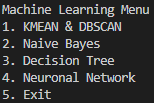

# Intrusion Detection with Machine Learning Algorithms

This repository contains the implementation of various machine learning algorithms for detecting intrusions in computer systems. Intrusion detection is a critical task in cybersecurity, where the goal is to identify malicious activities that could compromise the integrity, confidentiality, or availability of systems. The algorithms implemented here are widely used to analyze and classify network data, detecting patterns that may indicate intrusion attempts.

## Implemented Algorithms

This project includes implementations of the following machine learning algorithms:

1. **K-Means**
   - An unsupervised clustering algorithm that groups data samples into \(k\) clusters, helping to identify common patterns and detect anomalies that could represent intrusion attempts.

2. **DBSCAN (Density-Based Spatial Clustering of Applications with Noise)**
   - A density-based clustering algorithm that finds clusters of arbitrary shapes and is robust to noise in the data. It is useful for detecting outliers that may be intrusions.

3. **Decision Trees**
   - A supervised algorithm that builds a decision tree to classify events as normal or intrusions, offering interpretability and a structured analysis of the data.

4. **Naive Bayes**
   - A supervised algorithm based on Bayes' theorem, suitable for binary and multiclass classification problems. It is effective in detecting probabilistic patterns associated with intrusions.

5. **Neural Networks**
   - A supervised algorithm that simulates the behavior of the human brain to detect complex, non-linear patterns in data. It is particularly useful for capturing subtle relationships that may indicate malicious activity.

## Dataset

The algorithms in this repository have been trained and tested using the [UNSW-NB15 dataset](https://research.unsw.edu.au/projects/unsw-nb15-dataset). This dataset is a comprehensive benchmark dataset for network intrusion detection systems, containing a wide range of modern attack types and normal traffic.

## Requirements

To run the scripts, you need to have the following installed:

- Python 3.x
- The following libraries:
  - [Keras](https://keras.io/)
  - [Pandas](https://pandas.pydata.org/)
  - [NumPy](https://numpy.org/)
  - [scikit-learn](https://scikit-learn.org/)
  - [Matplotlib](https://matplotlib.org/)

 - You can install them executing the following command:
 ```
 pip install -r requirements.txt
 ```

 - You can run the program with the following command:
 ```
 python3 main.py
 ```
 - Then, just select the desired algorithm by writing the algorithm's number and pressing enter:



